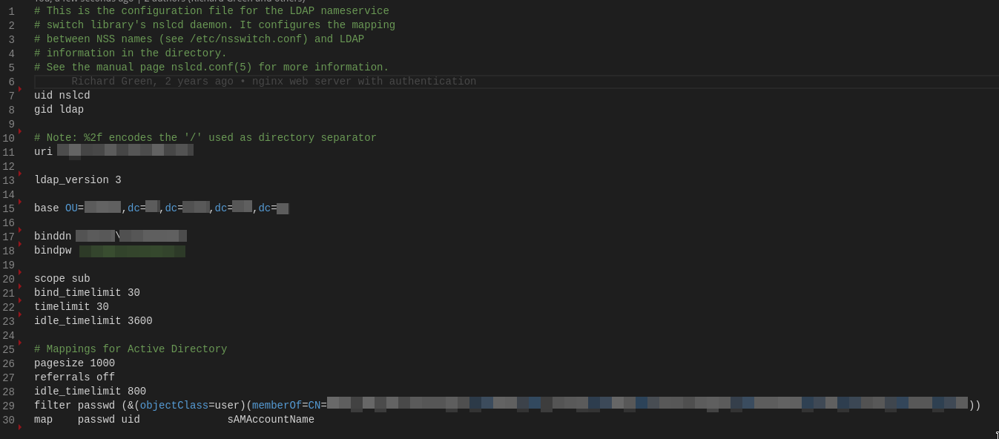

# HTTP basic auth using LDAP by the web server leveraging PAM

Nginx did not (at the time I built this, which is some years ago, as you can see by the nginx version in the example) have an ldap authn/z module I wanted to use, so I decided to use the operating system's PAM to carry out the ldap looupup instead. I had to compile nginx from source, because it's auth_pam module was not provided by default -  [https://www.nginx.com/resources/wiki/modules/](https://www.nginx.com/resources/wiki/modules/).

```bash
cd /usr/local/src/nginx-1.15.8
./configure --with-http_ssl_module \
  --with-http_v2_module \
  --add-module=../ngx_http_auth_pam_module-master \
  --conf-path=/etc/nginx/nginx.conf \
  --error-log-path=/var/log/nginx/error.log \
  --pid-path=/var/run/nginx.pid \
  --lock-path=/var/lock/nginx \
  --prefix=/usr/local \
  --user=nginx \
  --group=nginx \
  --http-log-path=/var/log/nginx/access.log 
  --with-http_sub_module

make && make install
```

Redhat package nss-pam-ldapd provides the glue for PAM to use nscld  (local LDAP name service daemon) and the PAM module itself (pam_ldap.so), which allows nginx to ask (via pam) the operating system do the LDAP lookup. Note we don't actually configure nss to use this, despite tha package name.

```bash
yum install nss-pam-ldapd
```

Create `/etc/pam.d/nginx-mon`, to allow PAM to load the pam_ldap module upon request. The nginx configuration will reference the file name:

```text
auth    required     pam_ldap.so
account required     pam_ldap.so
```

And then we confgure `nslcd` (It is the config of `/etc/nslcd.conf` which defines how we connect to LDAP (the package installed default has lots of useful info with, here is only shown the actual parts I use). An LDAP filter is used so only members of a particular AD group can log in):



Configure `nslcd`, so that it starts automaticly.

```bash
systemctl enable --now nslcd
```

Configure nginx use the service named nginx-mon. So in the nginx.conf in the server{} configuration, we add a couple of lines for auth_pam:

```text
    server {
        listen       443 ssl default_server;
        server_name  _;

        include       mime.types;
        default_type  application/octet-stream;

        ssl_certificate      /etc/pki/tls/certs/mycert.crt;
        ssl_certificate_key  /etc/pki/tls/certs/mykey.key;

        ssl_protocols TLSv1.1 TLSv1.2;
        ssl_ciphers HIGH:!aNULL:!MD5:!RC4;
        ssl_prefer_server_ciphers on;

        ssl_session_cache    shared:SSL:10m;
        ssl_session_timeout  10;

        location / {

            auth_pam "Authorized staff only";
            auth_pam_service_name "nginx-mon";

            root   /var/www/html/;
            index  index.html;

            client_body_temp_path /var/www/nginx/mon/client_body_temp 1 2;
            client_max_body_size 2g;
        }
    }
```
